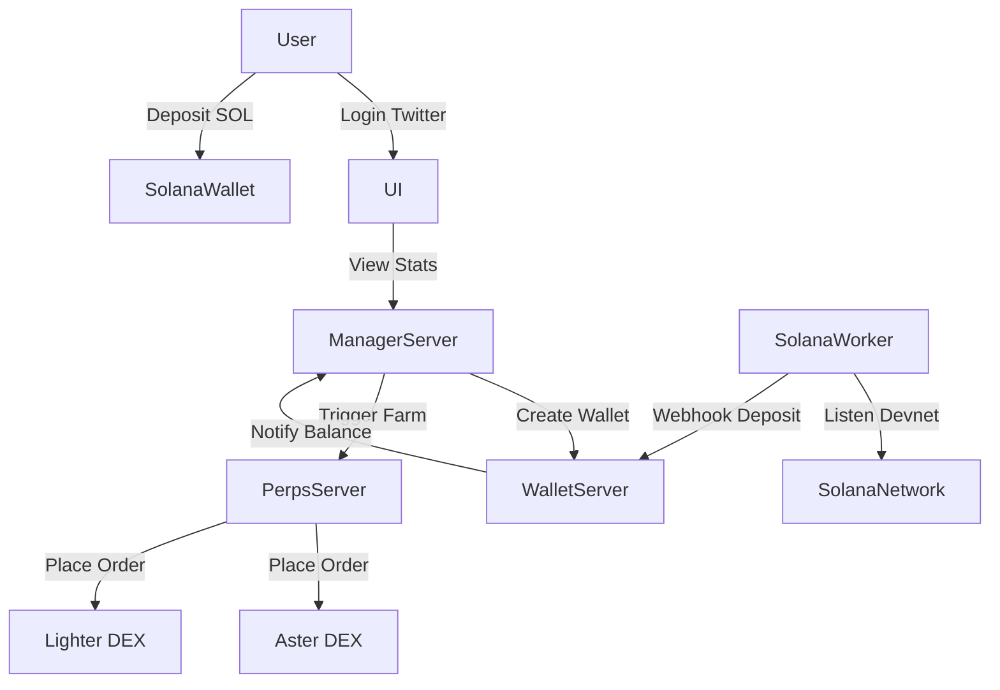

# Point Farming System Specification

## 1. Tổng quan (Overview)
Hệ thống "Point Farming" là một nền tảng **Custodial** cho phép người dùng nạp tiền vào ví do hệ thống quản lý. Hệ thống sẽ tự động sử dụng số tiền này để thực hiện các chiến lược giao dịch (Hedging) trên các sàn DEX (Aster, Lighter) nhằm mục đích "cày" volume/point mà không chịu rủi ro biến động giá lớn.

## 2. Kiến trúc hệ thống (Architecture)

Hệ thống bao gồm 4 thành phần chính:

1.  **`ui` (Next.js)**: Giao diện người dùng.
2.  **`manager-server` (NestJS)**: Backend quản lý User, Auth, Thống kê.
3.  **`wallet-server` (NestJS)**: Backend quản lý Ví, Private Key, Webhook nạp tiền.
4.  **`perps-server` (Python)**: Backend thực thi giao dịch (Trading Engine).

### Sơ đồ luồng dữ liệu (Data Flow)

## 3. Chi tiết chức năng (Functional Requirements)

### 3.1. Authentication & User Management (`manager-server`)
*   **Login**: Chỉ hỗ trợ đăng nhập qua **Twitter**.
*   **Onboarding Flow**:
    1.  User login Twitter thành công.
    2.  Hệ thống kiểm tra user mới.
    3.  Nếu mới -> Gửi thông báo qua **Telegram Bot** cho Admin ("New user: @username").
    4.  Admin (Manual/Tool) setup API Key của sàn (Aster/Lighter) cho user này trong Database (hoặc gán user vào pool account của hệ thống).
    5.  Hệ thống gọi `wallet-server` tạo ví nạp tiền riêng cho user.

### 3.2. Wallet & Deposit (`wallet-server` + `solana-worker`)
*   **Multi-chain Support**:
    *   Hiện tại: EVM (đã có).
    *   **Mới**: Solana (Devnet).
*   **Solana Worker**:
    *   Một process chạy ngầm (có thể tích hợp trong `wallet-server` hoặc chạy riêng).
    *   Nhiệm vụ: Lắng nghe transaction trên Solana Devnet.
    *   Khi phát hiện transaction nạp tiền vào ví của User -> Gọi Webhook về `wallet-server`.
*   **Webhook Handler**:
    *   `wallet-server` nhận webhook -> Verify transaction -> Update số dư User (gọi sang `manager-server` hoặc update DB chung).

### 3.3. Farming Strategy (`perps-server`)
*   **Chiến lược**: Hedging (Đối ứng).
*   **Cơ chế**:
    *   Tạo 1 lệnh **Limit Long** trên sàn A.
    *   Tạo 1 lệnh **Limit Short** trên sàn B (với cùng khối lượng).
    *   Mục đích: Giảm thiểu phí (Maker fee thấp hơn Taker fee) và giữ Delta Neutral.
*   **Vòng đời lệnh**:
    1.  Đặt cặp lệnh Limit.
    2.  Duy trì trong khoảng thời gian **N** (cấu hình được).
    3.  Hủy lệnh/Đóng vị thế sau thời gian N.
    4.  Lặp lại.

### 3.4. UI & Statistics (`ui`)
*   **Dashboard**:
    *   **Total Volume Farmed**: Tổng volume đã giao dịch.
    *   **Current Balance**: Số dư hiện tại trong ví hệ thống.
    *   **Order History**: Lịch sử các lệnh đã đặt (Time, Pair, Side, Size, Status).
*   **Interaction**:
    *   Nút "Start Farming" / "Stop Farming" (Optional - hoặc chạy tự động hoàn toàn).

## 4. Database Schema (Draft)

### Users
*   `id`: UUID
*   `twitter_id`: String
*   `twitter_handle`: String
*   `is_active`: Boolean

### UserWallets
*   `user_id`: UUID
*   `chain`: Enum (EVM, SOLANA)
*   `address`: String
*   `private_key_enc`: String (Encrypted)

### ExchangeKeys (Managed by Admin)
*   `user_id`: UUID
*   `exchange`: Enum (ASTER, LIGHTER)
*   `api_key`: String (Encrypted)
*   `api_secret`: String (Encrypted)

### Transactions (Deposits)
*   `tx_hash`: String
*   `user_id`: UUID
*   `amount`: Decimal
*   `token`: String
*   `status`: Enum (PENDING, CONFIRMED)

### FarmSessions / Orders
*   `id`: UUID
*   `user_id`: UUID
*   `start_time`: Timestamp
*   `end_time`: Timestamp
*   `total_volume`: Decimal

## 5. Kế hoạch triển khai (Implementation Plan)

### Phase 1: Manager & UI Skeleton
*   Setup `manager-server`: Auth, Database, Telegram Bot integration.
*   Setup `ui`: Login page, Dashboard layout.

### Phase 2: Wallet & Solana
*   Update `wallet-server`: Add Solana support.
*   Implement `solana-worker`: Listen devnet transactions.

### Phase 3: Farming Logic
*   Update `perps-server`: Implement Hedging Strategy (Limit Order + Timer).
*   Integrate `manager-server` -> `perps-server`.

### Phase 4: Integration & Testing
*   End-to-end test: Login -> Deposit -> Farm -> View Stats.
