# Point Farming System - Technical Specification

**Version:** 2.0  
**Last Updated:** 2025-11-26  
**Status:** In Development

---

## 1. Tổng quan (Overview)

**Point Farming System** là nền tảng **Custodial** tự động hóa chiến lược Hedging trên các sàn DEX (Aster, Lighter) để tối ưu hóa việc thu thập điểm thưởng (Points) mà không chịu rủi ro biến động giá.

### Core Concept
- **User**: Chỉ cần login, nạp tiền, chọn sàn → Hệ thống tự động farm.
- **Admin**: Quản lý API Keys, monitor balance, approve farming.
- **System**: Tự động tạo ví, thực thi chiến lược hedging, thống kê volume.

---

## 2. System Architecture

### 2.1 Components

```
┌─────────────┐     ┌──────────────────┐     ┌─────────────────┐
│     UI      │────▶│ Manager Server   │────▶│  Wallet Server  │
│  (Next.js)  │     │    (NestJS)      │     │    (NestJS)     │
└─────────────┘     └──────────────────┘     └─────────────────┘
                            │                          │
                            │                          │
                            ▼                          ▼
                    ┌──────────────────┐     ┌─────────────────┐
                    │  Perps Server    │     │ Solana Worker   │
                    │    (Python)      │     │   (Devnet)      │
                    └──────────────────┘     └─────────────────┘
                            │
                            ▼
                    ┌──────────────────┐
                    │   DEX (Aster,    │
                    │     Lighter)     │
                    └──────────────────┘
```

### 2.2 Service Responsibilities

| Service | Port | Responsibilities |
|---------|------|-----------------|
| **UI** | 3000 | User login, Dashboard, Stats visualization |
| **Manager Server** | 2567 | Auth (Twitter OAuth), User management, API key storage, Telegram bot |
| **Wallet Server** | 3001 | Wallet creation (Solana), Balance tracking, Deposit webhook |
| **Perps Server** | 8000 | Trading execution, Hedging strategy, Order management |

---

## 3. User Flow

### 3.1 Complete User Journey

```mermaid
sequenceDiagram
    participant User
    participant UI
    participant Manager
    participant Wallet
    participant Telegram
    participant Admin
    participant Perps
    
    User->>UI: 1. Login với Twitter
    UI->>Manager: OAuth callback
    Manager->>Manager: Tạo user trong DB
    Manager->>Telegram: Notify admin: "New user @username"
    Manager->>Wallet: Create Solana wallet cho user
    Wallet-->>Manager: Return wallet address
    Manager->>UI: Show wallet address
    
    User->>UI: 2. Chọn sàn farm (Aster/Lighter)
    UI->>Manager: POST /hedging/config
    Manager->>Manager: Save config, status = pending_wallet
    
    User->>User: 3. Nạp ≥ $10 USDC/USDT vào ví
    Wallet->>Wallet: Solana Worker phát hiện deposit
    Wallet->>Manager: Webhook: balance updated
    Manager->>Manager: Update user balance
    
    Admin->>Telegram: 4. Nhận thông báo "User có balance"
    Admin->>Admin: Kiểm tra KYC/Conditions
    Admin->>Manager: Manually tạo API key cho sàn
    Manager->>Manager: Store key in exchange_keys
    Manager->>Manager: Update status = farming
    
    Manager->>Perps: 5. Trigger hedging (API key + config)
    Perps->>Perps: Execute hedging strategy
    Perps-->>Manager: Return volume stats
    
    User->>UI: 6. Xem Dashboard (status, volume)
```



### 3.2 User States

| Status | Description | UI Display |
|--------|-------------|------------|
| `pending_wallet` | User chưa nạp tiền | "⏳ Đang chờ nạp tiền..." |
| `pending_setup` | Balance đủ, chờ admin setup key | "⚙️ Admin đang cấu hình..." |
| `farming` | Đang chạy chiến lược | "🟢 Đang cày - Vol: $1,234" |
| `stopped` | User/Admin dừng | "🔴 Đã dừng" |
| `error` | Có lỗi xảy ra | "⚠️ Lỗi - Liên hệ support" |

---

## 4. Database Schema

### 4.1 Manager Server Database

#### Table: `users`
```sql
CREATE TABLE users (
    id UUID PRIMARY KEY,
    twitter_id VARCHAR UNIQUE NOT NULL,
    username VARCHAR NOT NULL,
    display_name VARCHAR,
    avatar_url VARCHAR,
    is_active BOOLEAN DEFAULT TRUE,
    role VARCHAR DEFAULT 'user',
    created_at TIMESTAMP DEFAULT NOW(),
    updated_at TIMESTAMP DEFAULT NOW(),
    deleted_at TIMESTAMP
);
```

#### Table: `user_wallets`
```sql
CREATE TABLE user_wallets (
    id UUID PRIMARY KEY,
    user_id UUID REFERENCES users(id),
    chain VARCHAR NOT NULL, -- 'solana' | 'evm'
    public_key VARCHAR NOT NULL,
    balance_usdc DECIMAL(20,6) DEFAULT 0,
    balance_usdt DECIMAL(20,6) DEFAULT 0,
    last_check_at TIMESTAMP,
    created_at TIMESTAMP DEFAULT NOW(),
    updated_at TIMESTAMP DEFAULT NOW()
);
```

#### Table: `exchange_keys`
```sql
CREATE TABLE exchange_keys (
    id UUID PRIMARY KEY,
    user_id UUID REFERENCES users(id),
    exchange VARCHAR NOT NULL, -- 'aster' | 'lighter'
    config JSONB NOT NULL,
    /* Example config for Aster:
    {
        "api_key": "encrypted_key",
        "secret_key": "encrypted_secret",
        "api_url": "https://fapi.asterdex.com"
    }
    /* Example config for Lighter:
    {
        "public_key": "...",
        "private_key": "encrypted_...",
        "account_index": 1,
        "api_key_index": 0,
        "api_url": "..."
    }
    */
    is_active BOOLEAN DEFAULT TRUE,
    created_at TIMESTAMP DEFAULT NOW(),
    updated_at TIMESTAMP DEFAULT NOW()
);
```

#### Table: `hedging_configs`
```sql
CREATE TABLE hedging_configs (
    id UUID PRIMARY KEY,
    user_id UUID REFERENCES users(id),
    primary_exchange VARCHAR NOT NULL, -- Sàn user chọn
    hedge_exchange VARCHAR, -- Sàn đối ứng (admin config)
    symbol VARCHAR DEFAULT 'SOL-USDC',
    leverage INTEGER DEFAULT 5,
    amount_per_order DECIMAL(10,2) DEFAULT 10,
    status VARCHAR DEFAULT 'pending_wallet',
    -- Status: pending_wallet | pending_setup | farming | stopped | error
    created_at TIMESTAMP DEFAULT NOW(),
    updated_at TIMESTAMP DEFAULT NOW()
);
```

#### Table: `farming_stats`
```sql
CREATE TABLE farming_stats (
    id UUID PRIMARY KEY,
    user_id UUID REFERENCES users(id),
    date DATE NOT NULL,
    total_volume DECIMAL(20,6) DEFAULT 0,
    order_count INTEGER DEFAULT 0,
    pnl DECIMAL(20,6) DEFAULT 0, -- Lợi nhuận/lỗ
    created_at TIMESTAMP DEFAULT NOW(),
    UNIQUE(user_id, date)
);
```

#### Table: `admin_configs`
```sql
CREATE TABLE admin_configs (
    id UUID PRIMARY KEY,
    key VARCHAR UNIQUE NOT NULL,
    value VARCHAR,
    data JSONB,
    created_at TIMESTAMP DEFAULT NOW(),
    updated_at TIMESTAMP DEFAULT NOW()
);
```

---

## 5. API Specification

### 5.1 Authentication API (`manager-server`)

#### `GET /auth/twitter`
Khởi tạo OAuth flow với Twitter.

#### `GET /auth/twitter/callback`
Callback từ Twitter, tạo user mới nếu chưa tồn tại, trả về JWT token.

**Response:**
```json
{
  "accessToken": "eyJhbGc..."
}
```

#### `GET /auth/me`
Lấy thông tin user hiện tại (cần JWT Bearer token).

**Response:**
```json
{
  "id": "uuid",
  "username": "mr_mmon",
  "displayName": "Mr Mmon",
  "avatarUrl": "https://..."
}
```

---

### 5.2 Wallet API (`manager-server` → `wallet-server`)

#### `POST /wallets/generate`
**Request:**
```json
{
  "userId": "uuid",
  "chain": "solana"
}
```

**Response:**
```json
{
  "publicKey": "...",
  "balance": 0
}
```

#### `GET /wallets/:userId/balance`
**Response:**
```json
{
  "usdc": 15.50,
  "usdt": 0
}
```

---

### 5.3 Hedging Configuration API (`manager-server`)

#### `POST /hedging/config`
User chọn sàn farm.

**Request:**
```json
{
  "exchange": "aster" // hoặc "lighter"
}
```

**Response:**
```json
{
  "status": "pending_wallet",
  "walletAddress": "..."
}
```

#### `GET /hedging/status`
Lấy trạng thái farming hiện tại.

**Response:**
```json
{
  "status": "farming",
  "exchange": "aster",
  "volume_today": 1234.56,
  "balance": 12.30
}
```

---

### 5.4 Admin API (`manager-server`)

#### `POST /admin/exchange-keys`
Admin tạo API key cho user.

**Request:**
```json
{
  "userId": "uuid",
  "exchange": "aster",
  "config": {
    "api_key": "...",
    "secret_key": "...",
    "api_url": "https://fapi.asterdex.com"
  }
}
```

#### `GET /admin/users/pending`
Lấy danh sách user đang chờ setup (balance ≥ $10).

**Response:**
```json
[
  {
    "userId": "uuid",
    "username": "mr_mmon",
    "balance": 15.50,
    "exchange": "aster",
    "status": "pending_setup"
  }
]
```

---

### 5.5 Perps Server API (Internal)

#### `POST /api/hedging/start`
Manager Server gọi để khởi động farming.

**Request:**
```json
{
  "userId": "uuid",
  "exchange": "aster",
  "apiKey": "...",
  "secretKey": "...",
  "config": {
    "symbol": "SOL-USDC",
    "leverage": 5,
    "amount": 10
  }
}
```

---

## 6. External Integrations

### 6.1 Twitter OAuth
- **Provider:** `passport-twitter`
- **Callback URL:** `http://localhost:2567/auth/twitter/callback`
- **Scopes:** Basic profile info

### 6.2 Telegram Bot
- **Bot Token:** `TELEGRAM_BOT_TOKEN`
- **Admin Chat ID:** `TELEGRAM_ADMIN_CHAT_ID`
- **Topic ID:** `TELEGRAM_ADMIN_TOPIC`

**Notification Format:**
```
🎉 New User Registered

👤 Username: @mr_mmon
🔑 Twitter ID: 1234567890

⚠️ Action Required:
Please setup API Keys for this user in the admin panel.
```

### 6.3 Solana Devnet
- **RPC Endpoint:** `https://api.devnet.solana.com`
- **Worker:** Monitor ví của user, phát hiện deposit USDC/USDT

---

## 7. Security & Encryption

### 7.1 Sensitive Data Storage
- **Private Keys:** AES-256 encryption trước khi lưu DB.
- **API Keys:** AES-256 encryption.
- **Encryption Key:** Lưu trong `process.env.ENCRYPTION_KEY` (không commit vào Git).

### 7.2 API Authentication
- **User API:** JWT Bearer token (7 days expiry).
- **Internal API:** API Key authentication giữa các services.

---

## 8. Deployment Architecture

### 8.1 Development
- **Database:** PostgreSQL local
- **Ports:**
  - UI: 3000
  - Manager: 2567
  - Wallet: 3001
  - Perps: 8000

### 8.2 Production (Recommended)
- **Cloud Provider:** AWS/GCP/DigitalOcean
- **Services:**
  - EC2/VM cho backend services
  - RDS PostgreSQL
  - Redis cho cache
- **Domain:** `farming.example.com`
- **SSL:** Let's Encrypt

---

## 9. Monitoring & Logging

### 9.1 Metrics to Track
- Active farming users
- Total volume farmed (daily/monthly)
- Average PnL per user
- API success/failure rate
- Wallet deposit count

### 9.2 Logging Strategy
- **Format:** JSON (Pino logger)
- **Retention:** 30 days
- **Level:** INFO (production), DEBUG (development)

---

## 10. Future Enhancements

### 10.1 Phase 5: Additional DEX Support
- Hyperliquid
- dYdX v4
- Vertex Protocol

### 10.2 Phase 6: Advanced Features
- Auto-compound strategy
- Multi-pair farming (SOL-USDC + ETH-USDC)
- Referral program
- Leaderboard

---

## 11. Glossary

| Term | Definition |
|------|------------|
| **Hedging** | Chiến lược mở 2 vị thế đối ứng (Long + Short) để giảm rủi ro |
| **Delta Neutral** | Trạng thái tổng exposure = 0 |
| **Point Farming** | Hoạt động giao dịch để tích lũy điểm thưởng từ sàn |
| **Custodial** | Hệ thống giữ private key thay user |
| **DEX** | Decentralized Exchange (Sàn phi tập trung) |

---

**Document Maintained By:** Development Team  
**Contact:** Telegram @admin
