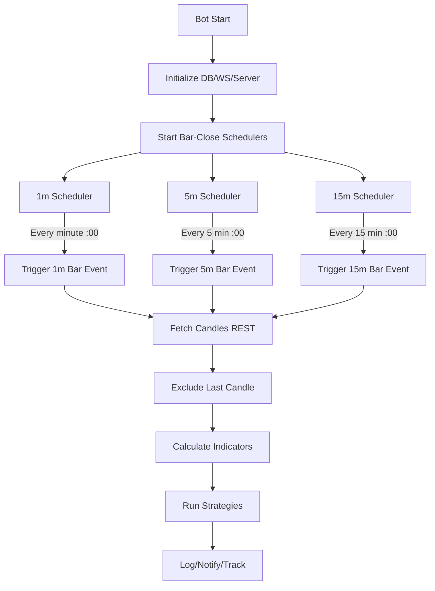

# Bar-Close Scheduler Implementation

## Problem

Current polling (POLL_INTERVAL=10s) causes:

- Indicator repaint (calculating on incomplete candles)
- Late/inaccurate signals ("call lúc quá bán/quá mua")
- Unnecessary API calls between bar closes

## Solution

Replace `setInterval(POLL_INTERVAL)` with event-driven scheduler that triggers strategy execution only at bar-close boundaries (00s mark for 1m, 5-minute marks for 5m, 15-minute marks for 15m).

## Architecture




## Changes

### 1. Create `src/bot/barCloseScheduler.js` (NEW)

Implement time-based scheduler that triggers at exact bar-close moments:

- Calculate next boundary (00s for 1m, :00/:05/:10 for 5m, :00/:15/:30/:45 for 15m)
- Schedule callback with precise delay
- Self-reschedule after each trigger (recursive)
- Execute strategies for all symbols with stagger to avoid rate limits

Key functions:

- `startBarCloseScheduler(symbols, strategies)` - main entry
- `schedule1mBar()` - schedule next 1-minute boundary
- `schedule5mBar()` - schedule next 5-minute boundary  
- `schedule15mBar()` - schedule next 15-minute boundary
- `onBarClose(timeframe, symbols, strategies)` - execute strategies when bar closes

### 2. Update `src/indicators/index.js`

Modify `calcIndicators()` to accept `options` parameter:

- Add `options.excludeLastCandle` flag (default: false for backward compat)
- When true, slice candles before processing: `candles.slice(0, -1)`
- Apply to all timeframes (15m/5m/1m)
- Affects: RSI, EMA, ATR, volume calculations, cross detection

Critical: Update `analyzeTimeframe()` helper to handle excluded candle:

```javascript
function analyzeTimeframe(candles, excludeLast = false) {
  const data = excludeLast ? candles.slice(0, -1) : candles
  if (data.length < 50) return null
  // ... rest of calculation using `data` instead of `candles`
}
```

Also update final indicator derivation (entry_close_1m, entry_prev_close_1m) to use correct indices.

### 3. Update `src/core/strategyExecutor.js`

Pass `excludeLastCandle: true` when calling `calcIndicators()` for scheduler-triggered executions:

```javascript
const indicators = calcIndicators(market, { excludeLastCandle: true })
```

Keep `excludeLastCandle: false` for manual API triggers (`force=true`) to maintain current behavior.

### 4. Update `src/index.js`

Replace polling loop with scheduler:

- Import `startBarCloseScheduler` from `bot/barCloseScheduler.js`
- Remove `POLL_INTERVAL` logic and `setInterval(runBotCycle, POLL_INTERVAL)`
- Call `startBarCloseScheduler(SYMBOLS, activeStrategies)` after server start
- Keep initial immediate execution option (configurable)
- Update console logs to reflect "Bar-Close Mode" instead of "Poll Interval"

### 5. Update `.env` documentation

Add new optional env vars:

- `BAR_CLOSE_MODE=true` (enable scheduler, default when no POLL_INTERVAL)
- Keep `POLL_INTERVAL` for backward compat (if set, use polling; if unset, use scheduler)

## Testing Strategy

1. Set `BAR_CLOSE_MODE=true` or remove `POLL_INTERVAL` from `.env`
2. Start bot and observe console logs for "Next 1m bar at HH:MM:00"
3. Watch terminal for strategy executions - should only happen at :00 seconds
4. Verify via `/ai-scalp?force=true` that indicators no longer repaint
5. Compare signal quality before/after (fewer "quá bán/quá mua" false triggers)

## Backward Compatibility

- If `POLL_INTERVAL` is set in `.env`, bot continues using polling mode
- If `POLL_INTERVAL` is unset or `BAR_CLOSE_MODE=true`, bot uses scheduler
- Manual API `/ai-scalp` always uses live candles (not excluded) unless explicitly configured

## Benefits

- Eliminates repaint: indicators calculated on closed candles only
- Reduces API calls by 80-90%: fetch only at bar close, not every 10s
- More accurate signals: trigger at exact moments when technical setup completes