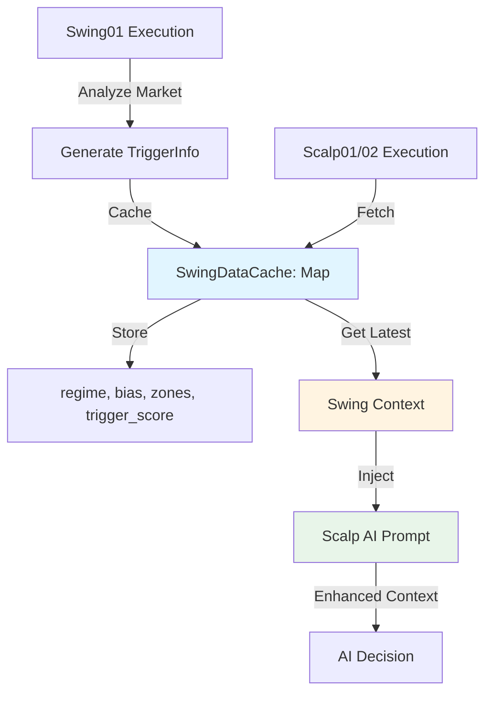

# Swing Data Cache for

Scalp Integration

## Overview

Cache Swing01 analysis results in-memory and inject core swing data (regime, bias, HTF zones, trigger score) into Scalp strategies' AI prompts to provide HTF context for scalping decisions.

## Architecture




## Implementation Details

### 1. Create Swing Data Cache Module

**File:** `src/data/swingDataCache.js`

- In-memory Map: `Map<symbol, { regime, bias, htf_zone, trigger_score, updatedAt }>`
- Functions:
- `setSwingData(symbol, triggerInfo)` - Update cache when Swing01 runs
- `getSwingData(symbol)` - Get latest cached data (returns null if stale/empty)
- `clearSwingData(symbol)` - Clear cache for symbol
- `getAllSwingData()` - Get all cached data (for debugging)

### 2. Update Swing01 Execution

**File:** `src/core/strategyExecutor.js`In `executeSwing01Strategy()`:

- After generating `triggerInfo`, call `setSwingData(symbol, triggerInfo)` to cache
- Cache only core data: `{ regime, bias, htf_zone, trigger_score }`

### 3. Update Scalp Strategies

**Files:**

- `src/strategies/Scalp01.js`
- `src/strategies/Scalp02.js`

In `buildAiPrompt(signal)`:

- Import `getSwingData` from `swingDataCache.js`
- Fetch swing data: `const swingContext = getSwingData(signal.symbol)`
- Add new section to prompt:
  ```javascript
    4. SWING CONTEXT (HTF - Higher Timeframe):
    - Regime: ${swingContext?.regime || 'N/A'}
    - Bias: ${swingContext?.bias || 'N/A'}
    - HTF Zone: ${formatZone(swingContext?.htf_zone) || 'N/A'}
    - Trigger Score: ${swingContext?.trigger_score || 'N/A'}/100
  ```


- Add rule: "5. Swing Context: Nếu HTF regime/bias trái ngược với scalp signal, cần thận trọng hơn."

### 4. Format Helper for Zones

**File:** `src/data/swingDataCache.js`Add helper function:

```javascript
function formatZone(zone) {
  if (!zone || !zone.type) return null
  const typeMap = { DEMAND: 'Demand', SUPPLY: 'Supply', EMA_RETEST: 'EMA Retest', RANGE_EDGE: 'Range Edge' }
  const type = typeMap[zone.type] || zone.type
  if (zone.priceRange && zone.priceRange.length >= 2) {
    const low = (zone.priceRange[0] / 1000).toFixed(0)
    const high = (zone.priceRange[1] / 1000).toFixed(0)
    return `${type} ${low}k-${high}k (Strength: ${zone.strength || 0}/5)`
  }
  return type
}
```


### 5. Cache Update Strategy

- **When:** Every time Swing01 executes (4H/1H/30M bar close)
- **What:** Core data only (regime, bias, htf_zone, trigger_score)
- **TTL:** Real-time (no expiration, always use latest)
- **Fallback:** If no cached data, show "N/A" in Scalp prompt (Scalp still works without swing data)

### 6. Error Handling

- If Swing01 fails, don't update cache (keep previous data)
- If cache is empty, Scalp strategies work normally (backward compatible)
- Log cache hits/misses for debugging

## Data Flow

1. **Swing01 runs** (on 4H/1H/30M bar close)

- Analyzes market → generates `triggerInfo`
- Calls `setSwingData(symbol, triggerInfo)` → updates cache

2. **Scalp01/02 runs** (on 1m/5m/15m bar close)

- Calls `getSwingData(symbol)` → retrieves latest swing context
- Injects swing data into AI prompt
- AI makes decision with HTF context

## Testing Strategy

1. **Unit Tests:**

- Cache set/get/clear operations
- Format helper functions
- Null/undefined handling

2. **Integration Tests:**

- Swing01 execution updates cache
- Scalp01 prompt includes swing data
- Scalp works without swing data (backward compatible)

3. **Manual Testing:**

- Run Swing01 → verify cache updated
- Run Scalp01 → verify prompt includes swing context
- Check AI responses consider HTF context

## Files to Modify

1. **New:** `src/data/swingDataCache.js` - Cache module
2. **Modify:** `src/core/strategyExecutor.js` - Update Swing01 execution to cache data
3. **Modify:** `src/strategies/Scalp01.js` - Add swing context to prompt
4. **Modify:** `src/strategies/Scalp02.js` - Add swing context to prompt (if different from Scalp01)

## Backward Compatibility

- Scalp strategies work normally if swing cache is empty
- No breaking changes to existing Scalp logic
- Swing data is "nice to have" enhancement, not required

## Performance Considerations