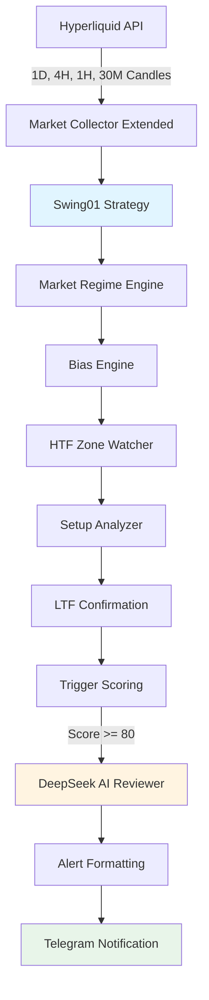

# Plan:

Swing01 Strategy Implementation

## Tổng quan

Triển khai chiến lược **Swing01** cho BTC theo [SWING_01_SRS_.md](docs/SWING_01_SRS_.md). Đây là bot **trigger-only** (không auto trade), chỉ phát hiện điều kiện swing-grade và gửi alert cho trader quyết định.

## Kiến trúc tổng quan



## Các component cần tạo

### 1. Mở rộng Market Collector

**File**: `src/data/marketCollector.js`

- Thêm hỗ trợ timeframes: `1d`, `4h`, `1h`, `30m`
- Mở rộng `getMarketSnapshot()` để trả về `candles_1d`, `candles_4h`, `candles_1h`, `candles_30m`
- Tính toán số giờ/ngày cần lấy để đủ 250 nến cho mỗi timeframe
- Cache riêng cho Swing01 data (khác với Scalp data)

### 2. Market Regime Engine

**File**: `src/strategies/swing01/MarketRegimeEngine.js`**Logic**:

- Phân tích trên 4H timeframe
- Tính EMA200 trên 4H
- Xác định TREND_UP, TREND_DOWN, RANGE, TRANSITION
- Stability: Regime chỉ đổi nếu giữ >= 3-5 candle 4H
- State management: Lưu regime history để check stability

**Output**: `{ regime: 'TREND_UP' | 'TREND_DOWN' | 'RANGE' | 'TRANSITION', confidence: 0-100 }`

### 3. Bias Engine

**File**: `src/strategies/swing01/BiasEngine.js`**Logic**:

- TREND_UP → LONG_ONLY
- TREND_DOWN → SHORT_ONLY
- Else → NO_TRADE
- Lock bias 24-48h, không flip trong ngày
- State management: Lưu bias + timestamp để check lock

**Output**: `{ bias: 'LONG_ONLY' | 'SHORT_ONLY' | 'NO_TRADE', lockedUntil: timestamp }`

### 4. HTF Zone Watcher

**File**: `src/strategies/swing01/HTFZoneWatcher.js`**Zone Types**:

- DEMAND: Support zone (low của swing)
- SUPPLY: Resistance zone (high của swing)
- EMA_RETEST: Vùng retest EMA200
- RANGE_EDGE: Biên của range

**Logic**:

- Phát hiện zone trên 1D/4H
- Freeze zone cho đến khi:
- Close HTF phá zone
- Hoặc regime đổi
- State management: Lưu active zones với metadata (type, price range, strength 1-5)

**Output**: `{ zones: [{ type, priceRange: [min, max], strength: 1-5, frozen: boolean }] }`

### 5. Setup Analyzer

**File**: `src/strategies/swing01/SetupAnalyzer.js`**States**: FORMING → MATURE → STALE / FAILED**Logic**:

- FORMING: Chạm HTF zone + HTF structure intact + Volume pullback giảm
- MATURE: Tồn tại >= 2-3 candle 4H
- STALE: > 6-10 candle 4H không expansion
- State management: Track setup lifecycle với timestamps

**Output**: `{ state: 'FORMING' | 'MATURE' | 'STALE' | 'FAILED', age: number (candles) }`

### 6. LTF Confirmation

**File**: `src/strategies/swing01/LTFConfirmation.js`**Logic**:

- Theo dõi BOS (Break of Structure) trên 1H/30M
- EMA50 / VWAP reclaim
- Volume expansion
- Rule: BOS phải được confirm bởi >= 2 close (không dùng wick)

**Output**: `{ confirmed: boolean, signals: ['BOS_1H', 'EMA50_RECLAIM', 'VOL_EXPANSION'] }`

### 7. Trigger Scoring

**File**: `src/strategies/swing01/TriggerScoring.js`**Weights**:

- Regime: 30
- HTF Zone: 30
- Structure: 25
- LTF: 10
- Momentum: 5

**Threshold**:

- <70: Ignore
- 70-79: Watch (log nhưng không alert)
- >=80: Swing-grade (gọi AI)

**Output**: `{ score: 0-100, breakdown: { regime, htfZone, structure, ltf, momentum } }`

### 8. Swing01 Strategy Class

**File**: `src/strategies/Swing01.js`**Extends**: `BaseStrategy`**Methods**:

- `checkConditions(signal)`: Kiểm tra trigger score >= 80, regime != TRANSITION, setup = MATURE
- `buildAiPrompt(signal)`: Build prompt theo format SRS (Senior Trader Reviewer)
- `parsePlan(decision, currentPrice)`: **KHÔNG parse entry/SL/TP** (vì là trigger-only), chỉ parse AI verdict

**Integration**:

- Gọi các engine theo flow: Regime → Bias → Zone → Setup → LTF → Scoring → AI
- State persistence: Lưu state vào memory (có thể mở rộng DB sau)

### 9. Swing Alert Format

**File**: `src/notify/swingAlert.js`**Format** (theo SRS):

```javascript
BTC – Swing Trigger Alert

Regime: TREND_UP (4H)
Bias: LONG_ONLY
HTF Zone: Demand 41k–42k (4/5)
Setup: MATURE
LTF: BOS 1H confirmed
Trigger Score: 82/100

AI View: CONSIDER (78%)
Note: HTF structure intact, pullback healthy.

This is NOT a trade signal. Trader decides execution and risk.
```

**Integration**: Sửa `src/notify/telegram.js` để detect strategy = 'SWING_01' và format khác

### 10. Swing Cooldown Manager

**File**: `src/notify/swingCooldown.js`**Rules**:

- Per zone: 12-24h
- Per setup: 24-48h
- Global: max 2-3 alerts/day

**State**: Track last alert per zone, per setup, global daily count

### 11. Mở rộng Bar Close Scheduler

**File**: `src/bot/barCloseScheduler.js`

- Thêm schedule cho 4H, 1H, 30M
- Swing01 chỉ chạy khi 4H bar close (hoặc 1H/30M nếu cần check LTF)
- Tách logic: Scalp strategies chạy trên 1m/5m/15m, Swing01 chạy trên 4H/1H/30M

### 12. Indicators cho Swing

**File**: `src/indicators/swingIndicators.js`**Functions**:

- `calcSwingIndicators(market)`: Tính EMA200, structure (HH/HL/LH/LL), volume analysis cho 1D/4H/1H/30M
- `detectBOS(candles, timeframe)`: Phát hiện Break of Structure
- `calculateVWAP(candles)`: Tính VWAP cho 1H/30M

### 13. Metrics Tracking

**File**: `src/strategies/swing01/SwingMetrics.js`**Metrics** (theo SRS):

- `triggers_per_day`
- `avg_trigger_score`
- `regime_changes_per_week`
- `ai_call_rate`
- `suppressed_triggers` (do cooldown)

**Storage**: Log vào DB hoặc memory (có thể mở rộng dashboard sau)

### 14. API Endpoint cho Swing01

**File**: `src/server.js`

**Endpoint**: Mở rộng `/ai-scalp` hoặc tạo `/ai-swing` riêng

**Logic**:

- Support `strategy=SWING_01` trong query params
- Gọi `executeStrategy()` với mode='api'
- Response format khác với Scalp:
  - **KHÔNG có** `plan` (entry/SL/TP)
  - **CÓ** `trigger_info` với:
    - `regime`: TREND_UP/TREND_DOWN/RANGE/TRANSITION
    - `bias`: LONG_ONLY/SHORT_ONLY/NO_TRADE
    - `htf_zone`: Zone info (type, priceRange, strength)
    - `setup_state`: FORMING/MATURE/STALE/FAILED
    - `ltf_confirmation`: BOS signals
    - `trigger_score`: 0-100
    - `trigger_breakdown`: Score breakdown
  - `ai_output`: AI verdict (CONSIDER/WAIT/AVOID), confidence, reasoning, invalidation_note

**Response Format**:

```json
{
  "message": "Cycle executed successfully",
  "market_ctx": { ... },
  "ai_input": "...",
  "ai_output": {
    "verdict": "CONSIDER",
    "confidence": 78,
    "reasoning": "...",
    "invalidation_note": "..."
  },
  "trigger_info": {
    "regime": "TREND_UP",
    "bias": "LONG_ONLY",
    "htf_zone": { "type": "DEMAND", "priceRange": [41000, 42000], "strength": 4 },
    "setup_state": "MATURE",
    "ltf_confirmation": { "confirmed": true, "signals": ["BOS_1H"] },
    "trigger_score": 82,
    "trigger_breakdown": { "regime": 30, "htfZone": 30, "structure": 20, "ltf": 10, "momentum": 2 }
  },
  "notification": "Sent to Telegram" | "Skipped (cooldown)" | null
}
```

**Integration**:

- Sửa `strategyExecutor.js` để detect strategy = 'SWING_01' và build `trigger_info` thay vì `plan`
- Update `swagger.yaml` để document endpoint với SWING_01

### 15. Database Schema & Logging

**File**: `src/data/db.js`

**Schema hiện tại** (Scalp):

- `plan` (JSONB): Entry/SL/TP cho Scalp
- `entry_price`, `stop_loss_price`, `take_profit_prices`: Cho Scalp
- `outcome`: OPEN/WIN/LOSS cho Scalp (auto trade tracking)

**Mở rộng cho Swing01**:

- Thêm column `trigger_info` (JSONB): Lưu trigger data cho Swing01
- Swing01 **KHÔNG** lưu `plan`, `entry_price`, `stop_loss_price`, `take_profit_prices` (vì trigger-only)
- Swing01 **KHÔNG** lưu `outcome = OPEN` (vì không auto trade, chỉ alert)

**Migration**:

```sql
ALTER TABLE logs_trade ADD COLUMN IF NOT EXISTS trigger_info JSONB;
```

**Trigger Info Structure** (JSONB):

```json
{
  "regime": "TREND_UP",
  "bias": "LONG_ONLY",
  "htf_zone": {
    "type": "DEMAND",
    "priceRange": [41000, 42000],
    "strength": 4
  },
  "setup_state": "MATURE",
  "ltf_confirmation": {
    "confirmed": true,
    "signals": ["BOS_1H", "EMA50_RECLAIM"]
  },
  "trigger_score": 82,
  "trigger_breakdown": {
    "regime": 30,
    "htfZone": 30,
    "structure": 20,
    "ltf": 10,
    "momentum": 2
  }
}
```

**AI Output cho Swing01** (lưu trong `ai_full_response`):

```json
{
  "verdict": "CONSIDER",
  "confidence": 78,
  "reasoning": "HTF structure intact, pullback healthy.",
  "invalidation_note": "Break below 40k would invalidate"
}
```

**Logic lưu log** (trong `strategyExecutor.js`):

```javascript
// Scalp: lưu plan
if (strategyName !== 'SWING_01') {
  saveLog({
    strategy: strategyName,
    plan: plan,
    entry_price: plan?.entry,
    stop_loss_price: plan?.stop_loss?.price,
    take_profit_prices: takeProfitPrices,
    outcome: outcome === 'OPEN' ? 'OPEN' : null
  })
}

// Swing01: lưu trigger_info
if (strategyName === 'SWING_01') {
  saveLog({
    strategy: 'SWING_01',
    trigger_info: {
      regime: regimeEngine.getRegime(),
      bias: biasEngine.getBias(),
      htf_zone: zoneWatcher.getActiveZone(),
      setup_state: setupAnalyzer.getState(),
      ltf_confirmation: ltfConfirmation.getConfirmation(),
      trigger_score: triggerScore.score,
      trigger_breakdown: triggerScore.breakdown
    },
    // KHÔNG có plan, entry_price, stop_loss_price, take_profit_prices
    // KHÔNG có outcome = OPEN (vì trigger-only)
    ai_action: decision.verdict, // CONSIDER/WAIT/AVOID
    ai_confidence: decision.confidence,
    ai_reason: decision.reasoning,
    ai_full_response: decision // verdict, confidence, reasoning, invalidation_note
  })
}
```

**Metrics Tracking** (theo SRS):

- Lưu metrics vào `market_snapshot` hoặc tạo bảng riêng `swing_metrics`
- Metrics: `triggers_per_day`, `avg_trigger_score`, `regime_changes_per_week`, `ai_call_rate`, `suppressed_triggers`
- Có thể query từ `logs_trade` với `strategy = 'SWING_01'` để tính metrics

**Cooldown & Filtering**:

- Sử dụng `shouldSaveNoTradeLog()` và `shouldSaveSkipLog()` như Scalp
- Swing01 có cooldown riêng (swingCooldown.js) nhưng vẫn dùng rate limiter chung

### 16. Fail-safe Handling

**Integration**: Trong `Swing01.checkConditions()` và `executeStrategy()`

- Hyperliquid lỗi → giữ state cũ, không trigger mới
- DeepSeek lỗi → gửi alert không AI (fallback)
- Không block hệ thống

## Files cần tạo mới

1. `src/strategies/Swing01.js` - Main strategy class
2. `src/strategies/swing01/MarketRegimeEngine.js`
3. `src/strategies/swing01/BiasEngine.js`
4. `src/strategies/swing01/HTFZoneWatcher.js`
5. `src/strategies/swing01/SetupAnalyzer.js`
6. `src/strategies/swing01/LTFConfirmation.js`
7. `src/strategies/swing01/TriggerScoring.js`
8. `src/strategies/swing01/SwingMetrics.js`
9. `src/indicators/swingIndicators.js`
10. `src/notify/swingAlert.js`
11. `src/notify/swingCooldown.js`

## Files cần sửa đổi

1. `src/data/marketCollector.js` - Thêm support 1d, 4h, 1h, 30m
2. `src/data/db.js` - Thêm migration cho `trigger_info` column, update `saveLog()` để support trigger_info
3. `src/strategies/index.js` - Register Swing01
4. `src/bot/barCloseScheduler.js` - Thêm schedule 4H, 1H, 30M
5. `src/notify/telegram.js` - Format swing alert
6. `src/core/strategyExecutor.js` - Handle swing-specific response format (trigger_info thay vì plan) và logic lưu log
7. `src/server.js` - Mở rộng `/ai-scalp` endpoint để support SWING_01
8. `swagger.yaml` - Update API docs với SWING_01 strategy và response format

## State Management

**Approach**: In-memory state (có thể mở rộng DB sau)

- Regime history: `Map<symbol, Array<{ regime, timestamp }>>`
- Bias lock: `Map<symbol, { bias, lockedUntil }>`
- Active zones: `Map<symbol, Array<Zone>>`
- Setup states: `Map<symbol, { state, age, createdAt }>`
- Cooldown: `Map<symbol, { lastAlert, dailyCount, zoneCooldowns, setupCooldowns }>`

## Backward Compatibility & Isolation

### Nguyên tắc thiết kế

1. **Tách biệt hoàn toàn**: Swing01 có flow riêng, không ảnh hưởng Scalp strategies
2. **Mở rộng, không thay đổi**: Chỉ thêm code mới, không sửa logic Scalp hiện có
3. **Conditional logic**: Dùng `if (strategy === 'SWING_01')` để tách biệt flow
4. **Shared components**: Chỉ mở rộng shared components (marketCollector, strategyExecutor), không thay đổi behavior mặc định

### Các điểm cần đảm bảo

#### 1. Market Collector (`src/data/marketCollector.js`)

- **Hiện tại**: Trả về `candles_15m`, `candles_5m`, `candles_1m`
- **Mở rộng**: Thêm `candles_1d`, `candles_4h`, `candles_1h`, `candles_30m` (optional)
- **Đảm bảo**: Scalp strategies vẫn nhận được data như cũ, không bị ảnh hưởng
- **Implementation**: Chỉ fetch thêm timeframes khi cần (lazy loading hoặc detect strategy type)

#### 1.1. Database (`src/data/db.js`)

- **Hiện tại**: Schema có `plan`, `entry_price`, `stop_loss_price`, `take_profit_prices` cho Scalp
- **Mở rộng**: Thêm column `trigger_info` (JSONB) cho Swing01
- **Đảm bảo**: Scalp vẫn lưu `plan` như cũ, Swing01 lưu `trigger_info` (conditional)
- **Implementation**: 
  - Migration: `ALTER TABLE logs_trade ADD COLUMN IF NOT EXISTS trigger_info JSONB;`
  - `saveLog()`: Chỉ lưu `trigger_info` khi `strategy === 'SWING_01'`, chỉ lưu `plan` khi Scalp

#### 2. Strategy Executor (`src/core/strategyExecutor.js`)

- **Hiện tại**: Build `plan` response cho Scalp, lưu log với `plan`, `entry_price`, `stop_loss_price`, `take_profit_prices`
- **Mở rộng**: 
  - Detect `strategy === 'SWING_01'` → build `trigger_info` response
  - Detect `strategy === 'SWING_01'` → lưu log với `trigger_info` (KHÔNG lưu plan)
- **Đảm bảo**: Scalp strategies vẫn nhận `plan` và lưu log như cũ
- **Implementation**:
  ```javascript
  // Trong executeStrategy() - Response format
  if (strategyName === 'SWING_01') {
    api_response.trigger_info = { ... }  // Swing01
  } else {
    api_response.plan = { ... }  // Scalp - giữ nguyên
  }
  
  // Lưu log
  if (strategyName === 'SWING_01') {
    saveLog({
      strategy: 'SWING_01',
      trigger_info: triggerInfo,  // Lưu trigger_info
      // KHÔNG có plan, entry_price, stop_loss_price, take_profit_prices
    })
  } else {
    saveLog({
      strategy: strategyName,
      plan: plan,  // Scalp - giữ nguyên
      entry_price: plan?.entry,
      stop_loss_price: plan?.stop_loss?.price,
      take_profit_prices: takeProfitPrices,
    })
  }
  ```


#### 3. Bar Close Scheduler (`src/bot/barCloseScheduler.js`)

- **Hiện tại**: Schedule 1m, 5m, 15m cho Scalp
- **Mở rộng**: Thêm schedule 4H, 1H, 30M cho Swing01
- **Đảm bảo**: Scalp schedulers vẫn chạy độc lập, không bị ảnh hưởng
- **Implementation**: Thêm functions riêng `schedule4hBar()`, `schedule1hBar()`, `schedule30mBar()`, chỉ trigger Swing01 strategies

#### 4. Telegram Notify (`src/notify/telegram.js`)

- **Hiện tại**: Format alert với `plan` (entry/SL/TP) cho Scalp
- **Mở rộng**: Detect `strategy === 'SWING_01'` → format alert với `trigger_info`
- **Đảm bảo**: Scalp alerts vẫn format như cũ
- **Implementation**:
  ```javascript
  if (strategy === 'SWING_01') {
    return formatSwingAlert(decision, triggerInfo)
  } else {
    return formatScalpAlert(decision, plan) // Logic cũ
  }
  ```


#### 5. Strategy Registry (`src/strategies/index.js`)

- **Hiện tại**: Registry SCALP_01, SCALP_02
- **Mở rộng**: Thêm SWING_01 vào registry
- **Đảm bảo**: Scalp strategies vẫn được load và chạy bình thường
- **Implementation**: Chỉ thêm entry mới, không sửa logic cũ

#### 6. API Endpoint (`src/server.js`)

- **Hiện tại**: `/ai-scalp` support SCALP_01, SCALP_02
- **Mở rộng**: Support thêm SWING_01
- **Đảm bảo**: Scalp API calls vẫn hoạt động như cũ
- **Implementation**: Chỉ thêm SWING_01 vào enum validation, response format tự động handle bởi strategyExecutor

### Testing để đảm bảo backward compatibility

1. **Regression tests cho Scalp**:

   - Test SCALP_01 với API call → verify response có `plan`
   - Test SCALP_02 với API call → verify response có `plan`
   - Test Scalp alerts → verify format không đổi
   - Test Scalp bar-close scheduler → verify vẫn trigger đúng

2. **Integration tests**:

   - Test Scalp và Swing01 chạy song song → không conflict
   - Test Scalp với marketCollector → verify vẫn nhận candles_15m/5m/1m
   - Test Swing01 với marketCollector → verify nhận thêm candles_1d/4h/1h/30m

3. **Manual verification**:

   - Chạy bot với ACTIVE_STRATEGIES=SCALP_01 → verify hoạt động bình thường
   - Chạy bot với ACTIVE_STRATEGIES=SCALP_01,SWING_01 → verify cả 2 chạy song song
   - Test API với strategy=SCALP_01 → verify response format cũ
   - Test API với strategy=SWING_01 → verify response format mới

## Testing Strategy

1. Unit tests cho từng engine (Swing01)
2. Integration test cho full flow (Swing01)
3. **Regression tests cho Scalp strategies (SCALP_01, SCALP_02)**
4. **Integration test Scalp + Swing01 chạy song song**
5. Manual test với real data (BTC)
6. Verify cooldown logic
7. Verify AI prompt format
8. **Verify backward compatibility: Scalp vẫn hoạt động như cũ**

## Dependencies

- Không cần thêm package mới (dùng `technicalindicators` có sẵn)
- Có thể cần thêm utility cho structure detection (HH/HL/LH/LL)

## Notes

- Swing01 **KHÔNG** parse entry/SL/TP (trigger-only)
- AI prompt theo format SRS (Senior Trader Reviewer, không đưa ra entry/SL/TP)
- Alert format khác với Scalp (không có plan)
- API response format khác Scalp: có `trigger_info` thay vì `plan`
- **Backward compatibility**: Tất cả logic Scalp (SCALP_01, SCALP_02) phải hoạt động như cũ, không bị ảnh hưởng
- **Isolation**: Swing01 có flow riêng, chỉ mở rộng shared components, không thay đổi behavior mặc định